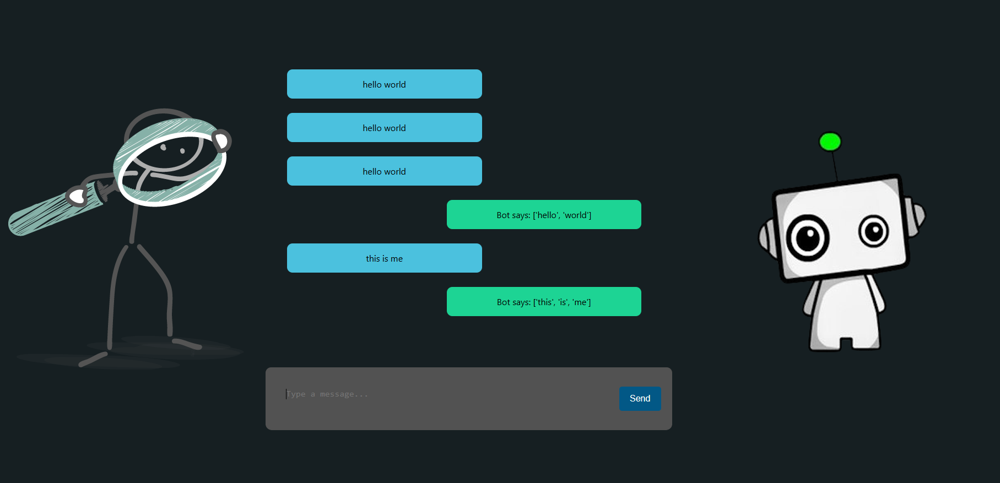

# Torch Bot using React and Flask

This project focuses on building an AI chatbot that leverages **PyTorch** for natural language processing (NLP). The application is structured with a **React** frontend and a **Flask** backend, providing a dynamic and interactive user experience.

## Features:
- **Basic Sentence Recognition**: The bot is capable of recognizing simple sentence patterns and processing them for appropriate responses.

- **Short Task Alert System**: The Flask server handles API requests and processes the user's inputs. If the user sends a list of tasks in string format, the bot will distinguish and optimize the tasks to create a schedule for a short task system. 

- **Outcome Predictions**: The bot responds to user input by analyzing the text using machine learning models trained with PyTorch. It identifies certain patterns in user data and predicts the next possible steps, enhancing the conversation flow.

### Under Development:
- **Basic Sentence Recognition**
- **Task Optimization**: the bot will soon be able to identify and categorize tasks provided by the user, creating an optimized schedule for short-term tasks based on priority and time constraints.
  
- **Basic Prediction Model**: The bot will be able to predict the next possible action based on a recognized pattern in the user input. This functionality is still being fine-tuned to accurately predict and improve interactions.

## How it works:
1. The **React** frontend collects user inputs and sends them to the backend via API calls.
2. The **Flask** backend processes the input using PyTorch models for NLP tasks like word recognition and understanding.
3. The backend returns a response, which is then displayed to the user in real-time on the frontend.

## Benefits:
- **Seamless Integration**: The combination of React and Flask ensures smooth communication between the user interface and AI-powered backend.
- **Interactive Experience**: Users can have live, interactive conversations with the bot, powered by advanced natural language processing.

---

**Note**: The **Alert System** and **Prediction Model** features are still in development and will be improved in future updates.
